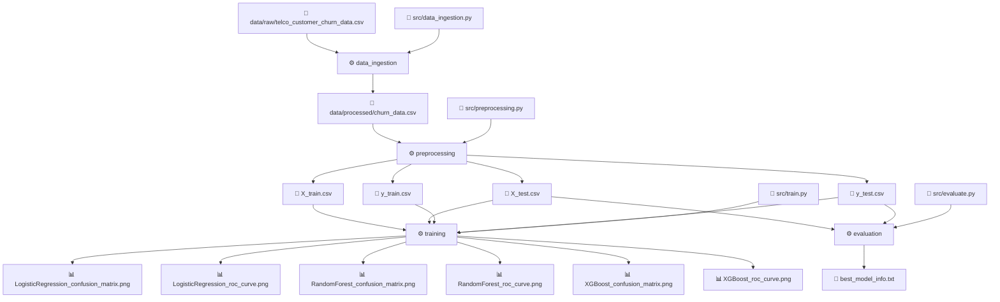

# 🎯 Customer Churn Prediction — End-to-End MLOps Pipeline

**SLTC Research University —  CCS 4340Machine Learning- Final Assignment**

---

## 👥 Team Members

| Name | Student ID | Part |
|------|-----------|------|
| Volga Indeewari| CIT-23-02-0159 | Part 1 — Data Engineering |
| Thilani Dilmani| CIT-23-02-0173 | Part 2 — Model Development |
| Nuwani Umanda | CIT-23-02-0153 | Part 3 — DVC Pipeline |
| Pramudi Biyonika | CIT-23-02-0345 | Part 4 — Airflow Orchestration |
| Ishini Sivod| CIT-23-02-0044 | Part 5 — REST API + Docker |
| Malith Shehan| CIT-23-02-0067 | Part 6 — DAGsHub Integration |

---

## 📌 Project Overview

This project builds a **production-grade ML system** to predict customer churn using the Telco Customer Churn dataset. The system integrates a full MLOps pipeline including data engineering, model development, pipeline versioning, workflow orchestration, REST API deployment, and experiment tracking — all connected via DAGsHub.

- **Dataset:** telco_customer_churn_data.csv
- **Target Variable:** Churn (Yes / No)
- **Best Model:** Random Forest (ROC AUC: 0.8624)

---

## 🏗️ Repository Structure

```
churn-mlops-project/
│
├── data/
│   ├── raw/                        # Raw dataset (DVC tracked)
│   │   └── telco_customer_churn_data.csv
│   └── processed/                  # Processed data (DVC tracked)
│       ├── X_train.csv
│       ├── X_test.csv
│       ├── y_train.csv
│       └── y_test.csv
│
├── src/
│   ├── data_ingestion.py           # Part 1 - Load raw data
│   ├── preprocessing.py            # Part 1 - Clean & transform data
│   ├── train.py                    # Part 2 - Train 3 models + MLflow
│   └── evaluate.py                 # Part 2 - Evaluate best model
│
├── airflow_dags/
│   └── churn_pipeline_dag.py       # Part 4 - Airflow DAG (6 tasks)
│
├── api/
│   └── main.py                     # Part 5 - FastAPI- REST API
│
├── models/                         # Saved model artifacts
│   └── best_model.pkl
│
├── reports/                        # Evaluation outputs
│   ├── metrics.json
│   └── evaluation.json
│
├── Dockerfile                      # Part 5 - Docker container
├── dvc.yaml                        # Part 3 - DVC pipeline stages
├── dvc.lock                        # DVC lock file
├── requirements.txt                # Python dependencies
├── .env                            # MLflow + DVC credentials
└── README.md
```

---

## 🔀 Data Pipeline (DVC DAG)



> 💡 Live, interactive version of this DAG is available on DAGsHub: [Data Pipeline View](https://dagshub.com/thilanisenarath403/churn-mlops-project) → click **Go to DVC → Pipeline**. GitHub doesn't run DVC, so this Mermaid diagram (rendered natively by GitHub) mirrors the same stage graph for reference here.

---

## ⚙️ Technology Stack

| Tool | Purpose |
|------|---------|
| Python 3.12 | Core language |
| scikit-learn | ML models |
| XGBoost | Gradient boosting model |
| MLflow | Experiment tracking |
| DVC | Data version control |
| Apache Airflow | Pipeline orchestration |
| FastAPI | REST API |
| Docker | Containerization |
| DAGsHub | MLOps platform (Git + DVC + MLflow) |

---

## 🔧 Setup Instructions

### 1. Clone the repository
```bash
git clone https://dagshub.com/thilanisenarath403/churn-mlops-project.git
cd churn-mlops-project
```

### 2. Install dependencies
```bash
pip3 install -r requirements.txt --break-system-packages
```

### 3. Configure DAGsHub credentials
Create a `.env` file:
```
MLFLOW_TRACKING_URI=https://dagshub.com/thilanisenarath403/churn-mlops-project.mlflow
MLFLOW_TRACKING_USERNAME=thilanisenarath403
MLFLOW_TRACKING_PASSWORD=YOUR_DAGSHUB_TOKEN
```

### 4. Pull DVC data
```bash
dvc pull
```

---

## 🚀 Running the Pipeline

### Run each step individually:
```bash
# Step 1 - Data Engineering
python3 src/data_ingestion.py
python3 src/preprocessing.py

# Step 2 - Model Training
python3 src/train.py

# Step 3 - Model Evaluation
python3 src/evaluate.py
```

### Or run full DVC pipeline:
```bash
dvc repro
```

---

## 🌐 Running the REST API

```bash
python3 -m uvicorn api.main:app --reload --port 8000
```

Open in browser:
- API: http://localhost:8000
- Interactive Docs: http://localhost:8000/docs

### Sample Prediction Request:
```json
POST /predict
{
  "gender": 1,
  "SeniorCitizen": 0,
  "Partner": 1,
  "Dependents": 0,
  "tenure": 12,
  "PhoneService": 1,
  "MultipleLines": 0,
  "InternetService": 1,
  "OnlineSecurity": 0,
  "OnlineBackup": 1,
  "DeviceProtection": 0,
  "TechSupport": 0,
  "StreamingTV": 1,
  "StreamingMovies": 1,
  "Contract": 0,
  "PaperlessBilling": 1,
  "PaymentMethod": 2,
  "MonthlyCharges": 65.5,
  "TotalCharges": 786.0
}
```

### Response:
```json
{
  "churn_probability": 0.0841,
  "prediction": "No",
  "model_used": "RandomForestClassifier"
}
```

---

## 🐳 Running with Docker

```bash
# Build Docker image
docker build -t churn-api .

# Run container
docker run -p 8000:8000 churn-api
```

---

## 🌀 Running Airflow DAG

```bash
# Start Airflow webserver
export AIRFLOW__CORE__EXECUTOR=SequentialExecutor
airflow webserver --port 8080

# Start scheduler (new terminal)
export AIRFLOW__CORE__EXECUTOR=SequentialExecutor
airflow scheduler
```

Open: http://localhost:8080
- Username: admin
- Password: admin

Trigger the `churn_prediction_pipeline` DAG to run all 6 tasks.

---

## 📊 Model Results

| Model | Accuracy | Precision | Recall | F1 Score | ROC AUC |
|-------|----------|-----------|--------|----------|---------|
| Logistic Regression | 0.8155 | 0.6771 | 0.5791 | 0.6243 | 0.8613 |
| **Random Forest** | **0.8006** | **0.6901** | **0.4477** | **0.5431** | **0.8624** ✅ |
| XGBoost | 0.8062 | 0.6656 | 0.5389 | 0.5956 | 0.8589 |

**Best Model: Random Forest (ROC AUC: 0.8624)**

---

## 🔗 DAGsHub Repository

```
https://dagshub.com/thilanisenarath403/churn-mlops-project
```

- **MLflow Experiments:** https://dagshub.com/thilanisenarath403/churn-mlops-project.mlflow
- **DVC Storage:** https://dagshub.com/thilanisenarath403/churn-mlops-project.dvc

---
## ✅ Conclusion

This project successfully demonstrates a complete end-to-end MLOps pipeline for customer churn prediction. Each team member contributed a key component — from raw data ingestion and preprocessing, through model training and evaluation, to automated orchestration and REST API deployment.

The pipeline achieves a best ROC AUC of **0.8624** using Random Forest, with all experiments tracked and versioned on DAGsHub via MLflow. Data versioning is handled by DVC, workflow automation by Apache Airflow, and the trained model is served via a FastAPI REST API containerized with Docker.

This project reflects real-world MLOps practices including reproducibility, automation, experiment tracking, and collaborative development — making it suitable for production deployment.

---
